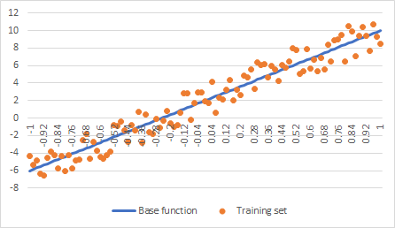
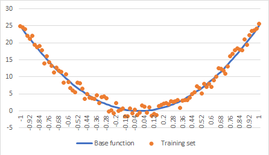
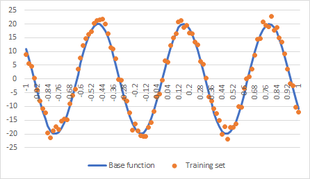
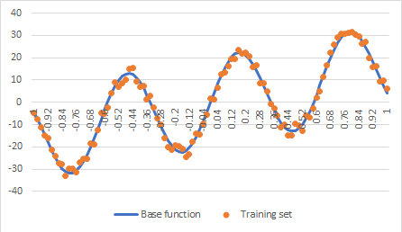

# Regression data sets

The folder contains data sets for regression examples. Each data set comes as CSV file with 3 columns:
1) X values of the function;
2) Y values of the function (base function);
3) noisy Y values of the function (training set).

The task for a regression application is to find the best fit given X and noisy Y values.

**Note**: the *data-source* folder contains original Excel files used to calculate those data sets.

## Line

## Parabola

## Sine

## Increasing Sine

