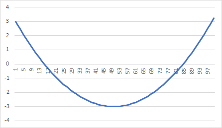
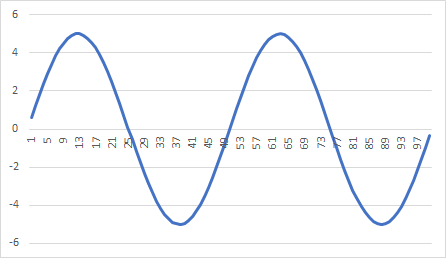
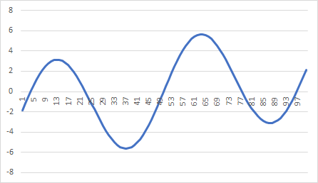

# Time series data sets

The folder contains data sets for time series prediction examples. Each data set comes as CSV file with a single column - values of the times series.

The task for a prediction application is to use portion of the data set to train predictor and then predict some of the points, which were not included into training.

**Note**: the *data-source* folder contains original Excel files used to calculate those data sets.

## Parabola

## Sine

## Increasing Sine

