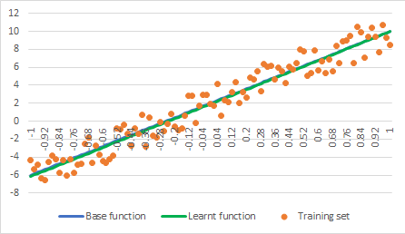
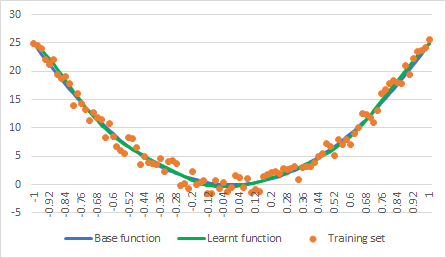
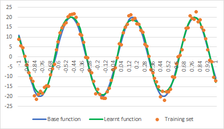
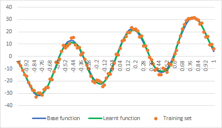

# Regression example with Fully Connected ANN

This example demonstrates usage of fully connected ANN for regression task. Taking [regression data sets](../data/regression/), it attempts finding best fit for the provided set of 2D points.

By default, it starts with 2 layers ANN – 10 neurons in the hidden layer and 1 neuron in the output layer. However, using command line options, it is possible to override network architecture and remove hidden layers at all, turning example into liner regression mode.

## Command line options
Some of the useful command line options are:
* -ec:<> - epochs count;
* -bs:<> - batch size;
* -lr:<> - learning rate;
* -hn:<X[:X]> - number of neurons in hidden layers; examples:

           0 - no hidden layers;
           10 - single hidden layer with 10 neurons;
           20:10 - two hidden layers - 20 neurons in the first and 10 in the second;
* -in:<> - file name to read input training data from;
* -out:<> - file name to write predicted results to.

## Neural network
Depending on the ANN architecture specified by command line options (or default one), the example application dynamically creates a network with required number of hidden layers/neurons. Note however, each hidden fully connected layer is followed by activation function adding non-linearity, but the output layer does not have activation function after it – this is to make sure the output is not saturated, i.e. can produce any value.

```C++
// prepare fully connected ANN of the specified structure
shared_ptr<XNeuralNetwork> net = make_shared<XNeuralNetwork>( );
size_t                     inputsCount = 1;

for ( size_t neuronsCount : trainingParams.HiddenLayers )
{
    net->AddLayer( make_shared<XFullyConnectedLayer>( inputsCount, neuronsCount ) );
    net->AddLayer( make_shared<XSigmoidActivation>( ) );
    inputsCount = neuronsCount;
}

// add output layer
net->AddLayer( make_shared<XFullyConnectedLayer>( inputsCount, 1 ) );
```

## Sample output
```
Regression example with Fully Connected ANN

Input data file  : data/sine-inc.csv
Output data file : data/sine-inc-out.csv
Learning rate    : 0.0100
Epochs count     : 1000
Batch size       : 10
Hidden neurons   : 20

Loaded 101 training samples

94.9963 96.3140 89.9999 87.4498 85.8198 84.2841 80.0137 75.3523 78.4216 76.6561
74.3379 72.4915 66.9306 63.5994 67.5616 59.7832 66.2729 56.0556 58.7726 54.3846
52.7562 49.1124 48.1114 48.9539 51.3070 45.2423 34.5317 19.8664 10.2619 6.2481
3.7535 2.8082 2.3494 2.1584 2.0237 1.9389 1.9323 1.7272 1.7796 1.7668
1.6363 1.8444 1.7594 1.7416 1.7307 1.5913 1.6094 1.7107 1.7113 1.6822
1.7847 1.6344 1.5772 1.6867 1.5896 1.6437 1.6023 1.5536 1.8257 1.6967
1.5220 1.7271 1.5821 1.6457 1.7364 1.5535 1.5767 1.6423 1.6086 1.8441
1.6201 1.5976 1.6128 1.7130 1.6009 1.6239 1.5667 1.6318 1.6613 1.6162
1.5636 1.5549 1.6445 1.6229 1.6610 1.6728 1.5671 1.6363 1.5651 1.6826
1.5966 1.6247 1.5937 1.5293 1.5866 1.5471 1.6104 1.5643 1.5645 1.6027
```

## Checking result
Output of the example application is not particularly useful other than checking cost value goes down. To see how good is the found function fit, the output CSV file should be checked. It contains 4 columns: 3 columns from the original input file and the 4th columns providing trained ANN's output for the specified X values.

Below are some of the examples obtained from the [regression data sets](../data/regression/). The blue line is the base function; orange points represent noisy function (the training set); the green line is the function learnt by the ANN.

## Line


## Parabola


## Sine


## Increasing Sine

