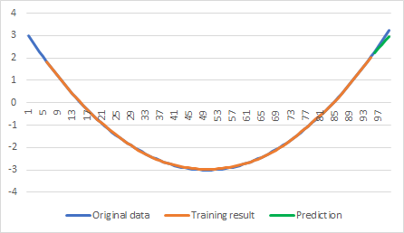
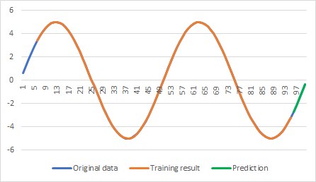
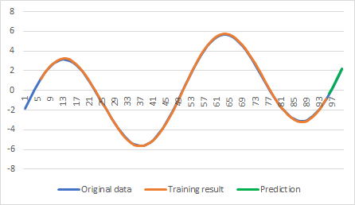

# Time series prediction example with Fully Connected ANN

This example demonstrates usage of fully connected ANN for time series prediction task. Taking [time series data sets](../data/time-series/), it trains neural network on a subset of the specified data and then uses the trained network to predict some of the data points, which were not included into the training.

Suppose a data set with 10 values is provided, window size of 2 is used and 3 values need to be predicted.

| v0 | v1 | v2 | v3 | v4 | v5 | v6 | v7 | v8 | v9 |
| -- | -- | -- | -- | -- | -- | -- | -- | -- | -- |
|  0 |  1 |  4 |  9 | 16 | 25 | 16 |  9 |  4 |  1 | 

The last 3 values of the data set (v7-v9) will not be used for training at all – those will be used only to compare with the final prediction. The remaining 7 values are then used to generate 5 training samples – 2 past values of the time series as input and the next value as desired output. So, the 5 training samples are:

| x1 | x2 |  y |
| -- | -- | -- |
|  0 |  1 |  4 |
|  1 |  4 |  9 |
|  4 |  9 | 16 |
|  9 | 16 | 25 |
| 16 | 25 | 16 |

A network is then trained using those training samples. Finally, two value are taken from the data set, v5 and v6, and the next value is predicted - v7' (v7 was not part of the training set, so something new for the network to predict). The input vector is then shifted and the just predicted value is appended (so we have v6 and v7' as input) - this is used to predict v8'. The process in then repeated till all value are predicted.

By default, the example starts with 2 layers ANN – 10 neurons in the hidden layer and 1 neuron in the output layer. However, using command line options, it is possible to override default network architecture.

## Command line options
Some of the useful command line options are:
* -ec:<> - epochs count;
* -bs:<> - batch size;
* -lr:<> - learning rate;
* -ws:<> - sliding window size used for training - number of past values to predict the next one;
* -ps:<> - prediction size - number of points to predict;
* -hn:<X[:X]> - number of neurons in hidden layers; examples:

           0 - no hidden layers;
           10 - single hidden layer with 10 neurons;
           20:10 - two hidden layers - 20 neurons in the first and 10 in the second;
* -in:<> - file name to read input training data from;
* -out:<> - file name to write predicted results to.

## Neural network
Depending on the ANN architecture specified by command line options (or default one), the example application dynamically creates a network with required number of hidden layers/neurons. Note however, each hidden fully connected layer is followed by activation function adding non-linearity, but the output layer does not have activation function after it – this is to make sure the output is not saturated, i.e. can produce any value.

```C++
// prepare fully connected ANN of the specified structure
shared_ptr<XNeuralNetwork> net         = make_shared<XNeuralNetwork>( );
size_t                     inputsCount = trainingParams.WindowSize;

for ( size_t neuronsCount : trainingParams.HiddenLayers )
{
    net->AddLayer( make_shared<XFullyConnectedLayer>( inputsCount, neuronsCount ) );
    net->AddLayer( make_shared<XTanhActivation>( ) );

    inputsCount = neuronsCount;
}

// add output layer
net->AddLayer( make_shared<XFullyConnectedLayer>( inputsCount, 1 ) );
```

## Sample output
```
Time Series Prediction example with Fully Connected ANN

Input data file  : data/series3.csv
Output data file : data/series3-out.csv
Learning rate    : 0.0100
Epochs count     : 1000
Batch size       : 10
Window size:     : 5
Prediction size  : 5
Hidden neurons   : 10

Loaded 100 time series data points

Created 90 training samples

0.1092 0.0908 0.1143 0.0866 0.0464 0.1154 0.0346 0.0656 0.0494 0.0362
...
0.0011 0.0006 0.0006 0.0016 0.0007 0.0009 0.0007 0.0004 0.0006 0.0011

Prediction error: min = 0.0453, max = 0.0704, avg = 0.0552
```

## Checking result
Output of the example application is not particularly useful other than checking cost value goes down and checking final prediction error. In addition, the example produces an output CSV file, which contains 3 columns: original data, training result (prediction of single point when providing original data as input) and final prediction (using predicted points to predict new ones).

Below are some of the examples obtained from the [time series data sets](../data/time-series/).


## Parabola


## Sine


## Increasing Sine

